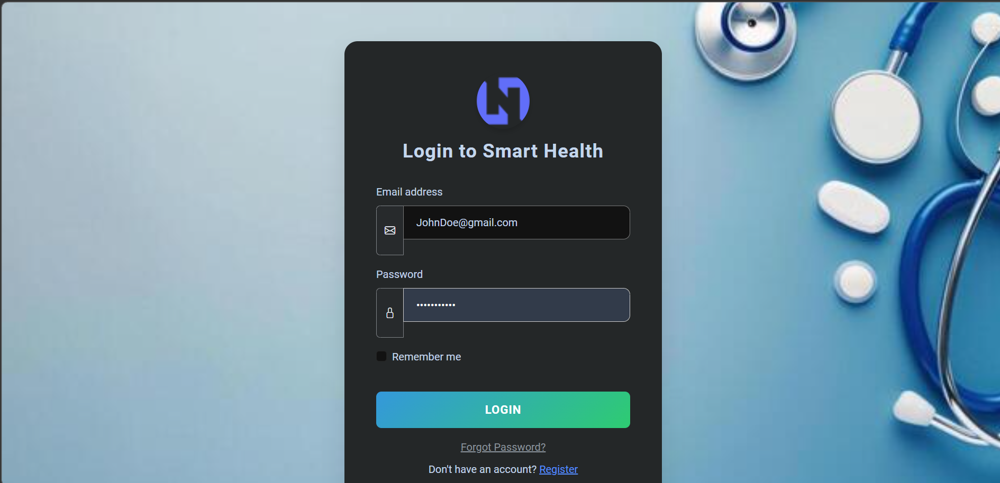
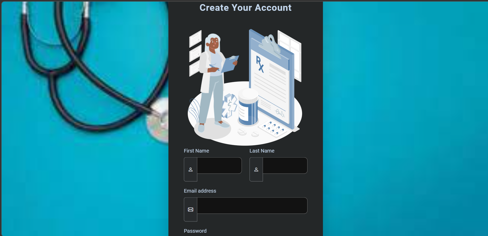
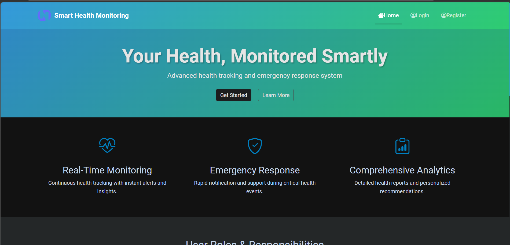
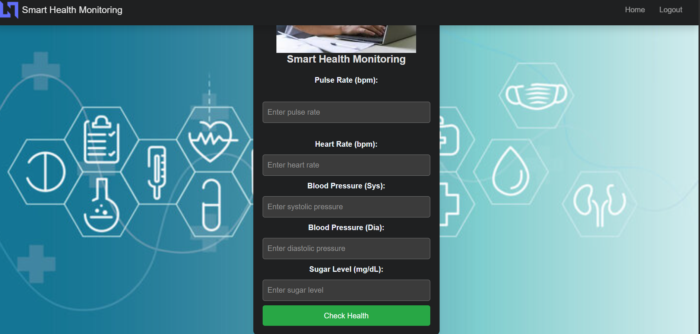
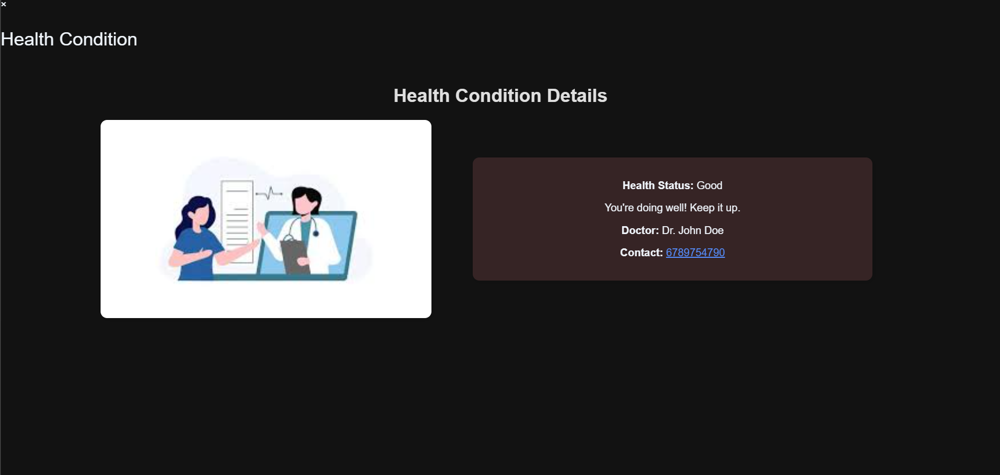

# 🏥 Smart Health Monitoring and Emergency Response System

## 📌 Description

This project is a web-based application developed using Django that helps in monitoring patient health data and providing emergency response support. It allows users to store, manage, and track health-related information efficiently.

---

## 🚀 Features

* 🧑‍⚕️ Patient health data management
* 📊 Real-time health monitoring
* 🚨 Emergency response system
* 🔐 Secure data handling
* 📁 User-friendly interface

---

## 🛠️ Tech Stack

* **Backend:** Python, Django
* **Frontend:** HTML, CSS, JavaScript
* **Database:** SQLite

---

## ⚙️ Installation & Setup

### Step 1: Clone the repository

git clone https://github.com/Jeno2002/smart-health-monitoring-system.git

### Step 2: Navigate to project folder

cd smart-health-monitoring-system

### Step 3: Create virtual environment

python -m venv venv

### Step 4: Activate virtual environment

venv\Scripts\activate

### Step 5: Install dependencies

pip install -r requirements.txt

### Step 6: Run migrations

python manage.py migrate

### Step 7: Run the server

python manage.py runserver

---

## 🌐 Usage

Open your browser and go to:
http://127.0.0.1:8000/

---

## 📸 Screenshots

(Add your project screenshots here)

---

## 💡 Future Improvements

* Add AI-based health prediction
* Integrate wearable device data
* Add mobile app support

---

## 👨‍💻 Author

**Infant Jeno J**

* GitHub: https://github.com/Jeno2002

---

## ⭐ Conclusion

This project demonstrates practical implementation of a healthcare monitoring system using Django, focusing on real-time data handling and emergency response.

---
## 📸 Screenshots

### 🔐 Login Page

### 📝 Register Page

### 🏠 Dashboard

### ❤️ Health Check Dashboard

### 📊 Health Condition

